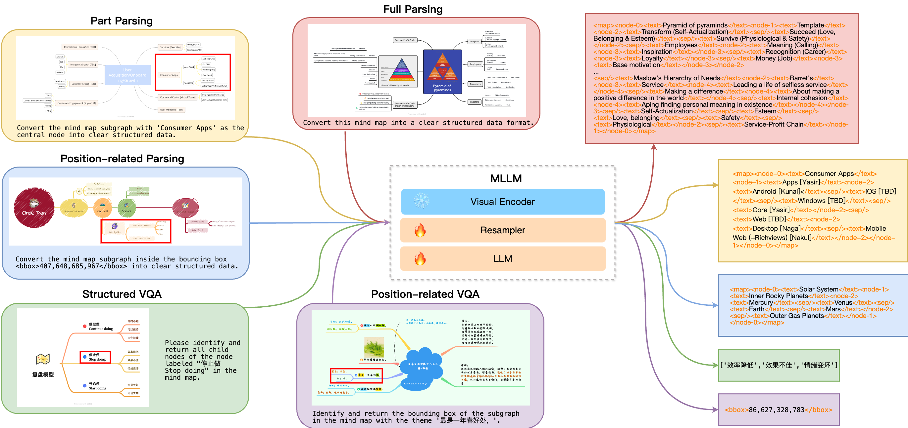

# MindBench: A Comprehensive Benchmark for Mind Map Structure Recognition and Analysis

[](https://creativecommons.org/licenses/by-nc/4.0/)
[](https://arxiv.org/abs/2407.02842)
[](https://miasanlei.github.io/MindBench.github.io/)
[](https://huggingface.co/datasets/MiaSanLei/MindBench)

<div align="center">
Lei Chen, Feng Yan, Yujie Zhong, Shaoxiang Chen, Zequn Jie†, Lin Ma†

† Corresponding Author
</div>



## Release

- [2024/7/6] The rendered images and source files of synthetic datasets are [available](https://huggingface.co/datasets/MiaSanLei/MindBench)!
- [2024/7/2] Our paper entitled "MindBench: A Comprehensive Benchmark for Mind Map Structure Recognition and Analysis" has been released in arXiv [Link](https://arxiv.org/abs/2407.02842).
- [2024/6/25] We have released the code of model evaluation, data synthesis and data parsing.
- [2024/6/24] The structured labels of synthetic and crawled datasets are [available](https://huggingface.co/datasets/MiaSanLei/MindBench)!

## MindBench Datasets

### Synthetic Dataset

We utilize the Graphviz tool to synthesize rich mind map data, encompassing five structured tasks with varying sample sizes: full parsing (200,000 samples), part parsing (40,000 samples), position-related parsing (40,000 samples), structured VQA (60,000 samples), and position-related VQA (60,000 samples).

Download synthetic dataset from huggingface [MiaSanLei/MindBench](https://huggingface.co/datasets/MiaSanLei/MindBench). Training data (~587G) are split into 18 files, run following cmds to prepare training and test images.
```
cat synth_v* > synth_train.tar.gz
tar -zxvf synth_train.tar.gz
tar -zxvf synth_test.tar.gz
```

The dataset is organized in the following format:
```
data_dir/
│
├── synth_v1/
│   ├── en_01/
│   │   ├── anno/
│   │   │   ├── sample1.json
│   │   │   └──  ...
│   │   ├── graph/
│   │   │   ├── sample1.gv
│   │   │   ├── sample1.png
│   │   │   └──  ...
│   │   └── img/
│   │   │   ├── sample1.jpg
│   │   │   └──  ...
│   ├── ...
│   ├── en_10/
│   ├── en_test/
│   ├── cn_01/
│   ├── ...
│   ├── en_10/
│   └── cn_test/
│
├── synth_v2/
│   ├── en_01/
│   │   ├── anno/
│   │   │   ├── sample1.json
│   │   │   └──  ...
│   │   ├── graph/
│   │   │   ├── sample1.gv
│   │   │   ├── sample1.json
│   │   │   ├── sample1.png
│   │   │   └──  ...
│   │   └── img/
│   │   │   ├── sample1.jpg
│   │   │   └──  ...
│   ├── ...
│   └── cn_test/
│
├── synth_en_train.jsonl
├── synth_cn_train.jsonl
├── synth_test_full_parse.jsonl
├── synth_test_part_parse.jsonl
├── synth_test_pos_parse.jsonl
├── synth_test_structured_vqa.jsonl
└── synth_test_pos_vqa.jsonl
```

The ```data_dir``` is the root directory where you place the dataset. The ```synth_v1``` and      ```synth_v2``` folders contain the source files of synthetic mind maps, with ```en_*``` and ```cn_*``` representing English and Chinese data, respectively. The ```anno``` folder contains the structured labels for each mind map. The ```graph``` folder includes the source files and rendered images generated by Graphviz. The ```img``` folder contains the mind map images with overlaid backgrounds, which serve as image input for the models. In the ```graph``` folder of ```synth_v2```, the JSON files store the coordinate attributes of each node in the mind map, enabling the design of structured tasks based on spatial positioning.

### Crawled Dataset


We collect real mind map data from XMind, Biggerplate, and Zhixi websites and generate structured labels for the mind maps through multi-step parsing. Download crawled dataset from [MiaSanLei/MindBench](https://huggingface.co/datasets/MiaSanLei/MindBench). It consists of 21,527 training samples and 1,558 test samples. To avoid potential risks, we do not provide the source image files of the mind maps. Instead, we offer download links for the mind maps and the parsed structured labels. The image data can be obtained through the download links.

The dataset is organized in the following format:
```
data_dir/
│
├── xmind_en_png/
├── xmind_cn_png/
│   ├── xmind_app_png/
│   ├── xmind_IT互联网_png/
│   ├── xmind_个人成长_png/
│   ├── xmind_其他_png/
│   ├── xmind_各行各业_png/
│   ├── xmind_大开脑洞_png/
│   └── xmind_教育_png/
│   └── xmind_生活娱乐_png/
│   └── xmind_读书笔记_png/
├── bxmind_png/
├── bmmanger_png/
├── zhixi_png/
│   ├── zhixi_png_1/
│   ├── ...
│   └── zhixi_png_6/
│
├── crawled_data_train.jsonl
├── xmind_en_test.jsonl
├── xmind_en_test_easy.jsonl
├── xmind_cn_test.jsonl
├── xmind_cn_test_easy.jsonl
├── bxmind_test.jsonl
├── bxmind_test_easy.jsonl
├── bmmanger_test.jsonl
├── bmmanger_test_easy.jsonl
├── zhixi_test.jsonl
└── zhixi_test_easy.jsonl
```

Here, ```*_test.jsonl``` represents the test set, while ```*_test_easy.jsonl``` represents the test set consisting of samples with fewer than 60 nodes.

## Model Evaluation

Prepare environments for evaluation as follows:
```
pip install zss
pip install nltk
pip install scikit-learn
```

Taking IXC2-4KHD as an example, the model's inference result file format is as follows:
```
[
    {
        'image': ['synth_v2/en_test/img/20240521200137_09f31cee-f9ea-4ec9-821c-e2e5d4238315.jpg'],
        'prompt': '',
        'text': '',
        'system_instruction': '',
        'conversations': [
            {'from': 'user', 'value': '<image>'},
            {'from': 'user', 'value': 'Please describe the central theme of the mind map depicted in the provided image.'},
            {'from': 'assistant', 'value': 'BCE in both the digestive and re'}
        ],
        'task_type': 'qa_sft',
        'model_answer': ' :CE in both the digestive and re'
    },
    {
        'image': ['synth_v2/en_test/img/20240521200137_3a712d4b-90e9-470d-9035-b3f763eea70e.jpg'],
        'prompt': '',
        'text': '',
        'system_instruction': '',
        'conversations': [
            {'from': 'user', 'value': '<image>'},
            {'from': 'user', 'value': 'Please determine and inform which level the node labeled "he 19th century" is located on in the mind map.'},
            {'from': 'assistant', 'value': '4'}
        ],
        'task_type': 'qa_sft',
        'model_answer': ' 4'
    }
]
```

For example, to evaluate the model on XMind_en parsing task, you can run:
```
cd evaluation
python3 run_evaluation_official.py --result_path evaluate_results/xmind_en_test_easy.jsonl
```

To evaluate the model on Structured VQA task:
```
python3 run_evaluation_official.py --result_path evaluate_results/synth_test_structured_vqa.jsonl
```

<!-- Evaluate DocOwl1.5/DocOwl1.5-Chat on 10 downstream tasks:
```
python docowl_benchmark_evaluate.py --model_path $MODEL_PATH --dataset $DATASET --downstream_dir $DOWNSTREAM_DIR_PATH --save_dir $SAVE_DIR
``` -->


## Data Synthesis

Prepare the graphviz and pygraphviz environments for data synthesis as follows:
```
sudo yum install graphviz
sudo yum install graphviz-devel
conda install --channel conda-forge pygraphviz
```

The following command is an example of synthesizing mind map data. You can modify the parameter settings in the files to generate a more diverse set of mind map data.
```
cd synthesis
python3 context.py
python3 mindmap.py
```
Here, ```context.py``` is used to generate structured labels for mind maps, while ```mindmap.py``` is used to render mind map images using the Graphviz tool and overlay backgrounds to increase data diversity.

Note: Please manually install the fonts located in the ```resources/fonts``` directory. Specifically, move all the files in that directory to the ```.fonts``` folder in your home directory. Create the .fonts folder if it doesn't exist. Then, refresh the cache by executing ```fc-cache -fv```. Use the ```fc-list : family``` command to view the supported fonts by the system.


## Data Parsing

### Synthetic Dataset

Based on the source file of the synthetic data, we construct the JSON label file for the dataset using the following command:
```
cd parsing
python3 prepare_synth_anno.py
```

Then, we generate label files for different tasks and convert the JSON format into token sequences using the following command:
```
python3 prepare_parse_vqa.py --parse_type full
python3 prepare_parse_vqa.py --parse_type part
python3 prepare_structured_vqa.py
python3 prepare_pos_vqa.py --pos_type parse
python3 prepare_pos_vqa.py --pos_type vqa
```

### Crawled Dataset

We construct the training labels for the crawled dataset using the following command:
```
cd parsing
python3 prepare_crawl_anno.py
```

Specifically, the construction includes the following steps:
1. Convert HTML files to nested JSON format
  - `parse2json`: Parse HTML files in all dataset folders ending with `_anno` in the directory. Each HTML file is converted to a JSON file.

2. Prepare training and test labels
  - `prepare_anno`: Generate label files based on the JSON files, storing the image paths and ground truth for each sample. One file is generated for each dataset.
  - `split_data`: Split the dataset into train and test sets.
  - `filter_difficult_mindmap`: Further divide the dataset into a simple test set based on the number of nodes.

3. Convert JSON format labels to token sequences for training
  - `prepare_ureader_train_anno`: Generate labels in the format of UReader conversation, combining all datasets into one file.
  - `prepare_ureader_val_anno`: Generate separate test files for different datasets, using the same label format as above.

The final files used for training and test are `train.jsonl`, `bxmind_test_easy.jsonl` and `bmmanger_test_easy.jsonl`.

## Citation
If you found this work useful, consider giving this repository a star and citing our paper as followed:
```
@article{chen2024mindbench,
        title={MindBench: A Comprehensive Benchmark for Mind Map Structure Recognition and Analysis},
        author={Chen, Lei and Yan, Feng and Zhong, Yujie and Chen, Shaoxiang and Jie, Zequn and Ma, Lin},
        journal={arXiv preprint arXiv:2407.02842},
        year={2024}
}
```

